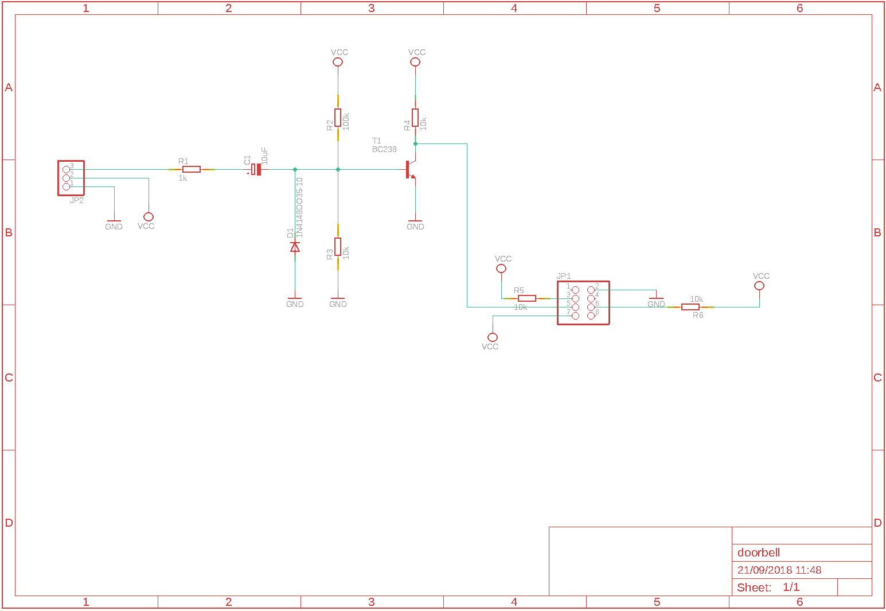
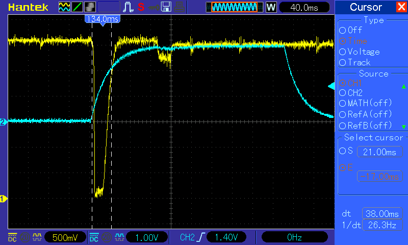
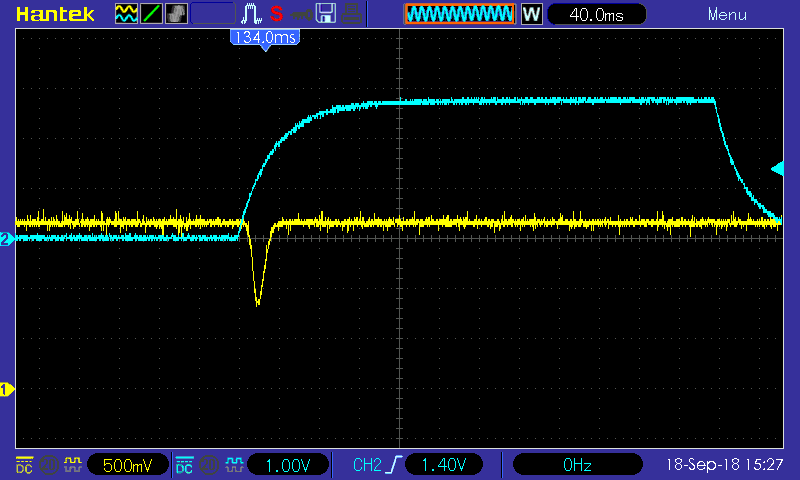
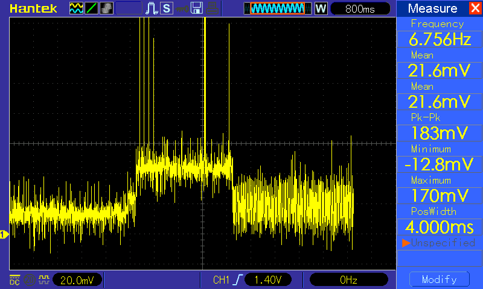

# Doorbell via MQTT

Using an ESP8266-01 in deep sleep mode and MQTT to convert a run of the mill doorbell into a Wifi doorbell.

## The Hardware

We have a cheap wireless doorbell at home, which unfortunately uses a proprietary wireless protocol (on 433 MHz) to send a signal from the doorbell button to the actual chime thingy on the wall. I wanted to integrate this into my growing home automation system based on [OpenHAB](https://openhab.org).

### The doorbell

The doorbell is a "Silverline Wireless Doorbell, Model WA-638S" purchased from Clas Ohlson here in Norway. It provides 8 chime melodies, has 64 channels to choose between in case of interference, runs on 3xAA batteries (doorbell) and one 12V V23GA battery (button).

(I forgot to take pictures before installing my improvement, so this is the 'after action' shot with the ESP board already installed.

When opened, I found that the chip used is a more or less standard issue for these kinds of circuits, labeled CIR2272AN-L4. I found a [datasheet](http://www.princeton.com.tw/Portals/0/Product/PT2272.pdf) for this chip from the Taiwanese company Princeton Technology Corp, they call it PT2272. The PT 2272 is a remote controlled decoder, and they provide a matching encoder (PT2262). Pinout and functionality seem to be identical with the chip used in the current doorbell.

The small vertical board is the actual sound generator, which is started by a short positive impulse on pin 17 (VT - valid transmission) of the decoder chip. The actual melody is provided through the data outputs D0-D3 from the decoder chip, which is send as payload in the transmission.

The actual signal is a positive pulse of about 400 ms on pin 17, VT which triggers the sound processor.

### ESP-01 and schematic

As the solution is battery based, I wanted to utilise deep sleep state of the ESP chip, to minimize current and maximize battery life. It happens that the ESP-01 does not have the required connection from GPIO16 to RST pins, which normally would take care of waking up the ESP from deep sleep. But for this solution, I replace this with an external signal to wake the ESP from deep sleep.

The ESP chips reset signal is a falling edge on the RST pin. The pulse on pin VT is a 400ms positive pulse, and I didn't want to wait nearly half a second before resetting the ESP. So I use a simple circuit to convert the rising edge of the pulse into a negative pulse, to provide the falling edge the ESP needs on its RST pin.

The length of the pulse is defined by the choice of C1 and R3, and with 10K and 10uF I get roughly 100ms for the RC value. The ESP will start on the falling edge, so the actual length of the pulse is not really that critical.

When the input signal rises from 0 to Vcc, C1 is charged via R1 and R3. The resulting current accross R3 provides a base voltage on T1, enough to switch T1 'fully on'. This draws the collector towards GND, resulting in the sharp falling edge of the pulse. When C1 is charged, the voltage drops again and T1 is 'switched off'.

Channel 1 (yellow) is the signal at the RST pin, Ch2 (blue) is the input signal (VT) from the decoder chip. Both signals are actually 3.3V, Ch1 is set at 500mV/Div, while Ch 2 is at 1V/Div. Testing with external power supply. Triggering on rising edge on Ch2 (the input signal).

While testing, I used an external power supply to provide stable 3.3V to the circuit, which worked fine as can be seen from the scope picture. But when I connected the circuit to the battery, I experienced that the pulse created was different. It looked like the signal from the RC net was not high enough for T1 to go into saturation, and I realized that I needed to bias the input.

First test on battery - clearly a different signal!

I introduced R2, which together with R3 is a voltage divider providing a biasing voltage of about 0.27V to the base of T1. This is enough to raise the signal, and to provide a clear RST pulse also while on battery.

### Current consumption

I measured current consumption of my final setup by measuring the voltage drop over a 1 Ohm resistor connected in serial to the positive terminal of the battery (the resistor is actually part of the original doorbell).

While sleeping, I measure about ~10-15 mV regardless whether the ESP is connected or not, corresponding to 10-15mA. This is as expected, as the deep sleep current of the ESP is in the order of 20uA, which I just wouldn't be able to make out in my setup here.

When the doorbell is ringing, I see the current rise to about 40-50mA, with spikes up to 200mA for about 2.5 seconds before dropping to 10-15mA again.

Current rises to 40-50mA when ESP is activated, falls to standard level when ESP goes into deep sleep.

The red LED on the ESP board is removed, as this would just uncessarily drain the battery. The LED is not visible anyway from outside.

### Bill of materials

* 1 Doorbell with 2262/2272 style wireless transmission
* 1 ESP-01 module
* 1 1k resistor
* 4 10k resistors
* 1 100k resistor
* 1 10uF capacitor (could be anything between 1..47uF, but lower is better I guess)

## The Software

My initial approach was to utilise the same OTA updateable script as with my other projects, but this meant that the ESP would need to stay on longer, and possibly even need to wake up regularly to check for updates. I didn't want that, so I ended up with dropping the code, and streamlining it to just go through the following steps:

* read config
* setup wireless
* when wireless connected, setup and connect to MQTT broker
* when connected to the broker, immediately publish the message
* go to sleep, also in case of errors

### Installation

Fit the configuration in 'doorbell.ini' to your setup and copy to the ESP with the name of 'config.ini'. Copy 'doorbell.lua' to the ESP, use 'init.lua' as filename unless you want to start it by hand. Keep in mind that the ESP will wake up after deep sleep and will execute the script like it started for the first time - for automatic operation, you will probably need to call the script 'init.lua', or have another script to take care of starting the doorbell script.

## Improvements

To implement OTA updates, one could wire the connection from pin 8 (GPIO16) on the ESP chip to the RST pin, providing a possibility to wake from deep sleep based on the internal RTC.

Another possibility is to use modem sleep, and to 

I could also revamp the whole design, even replace the decode chip completely and migrate to a Wifi-based transmission - building an ESP-based button and transmitting the signal via MQTT. 
